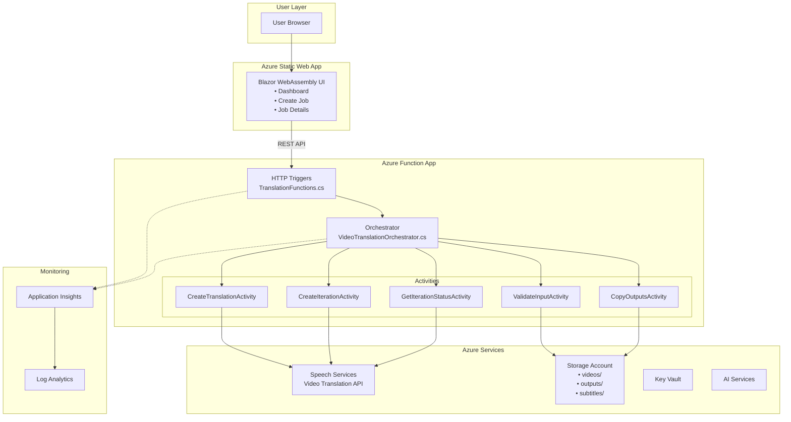
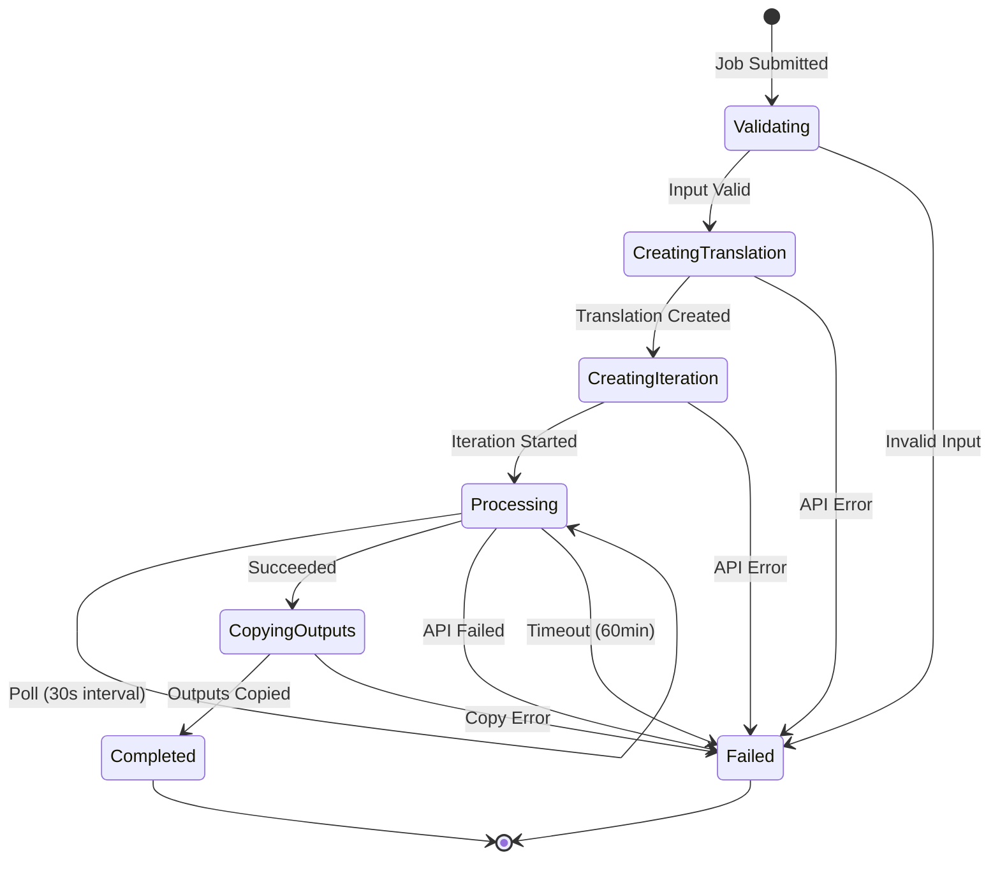
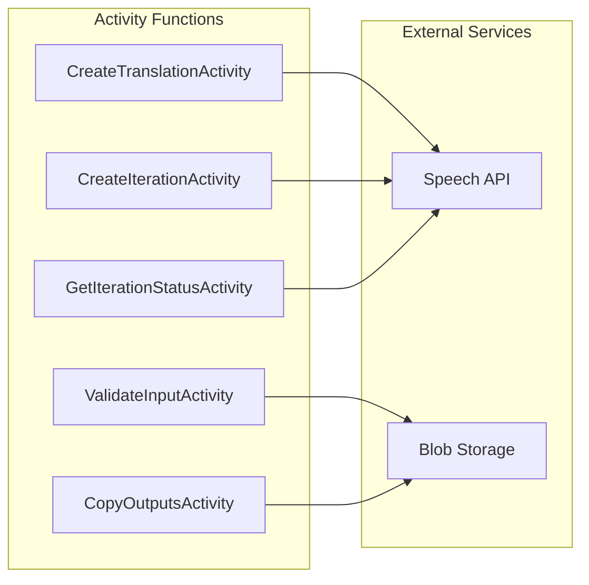
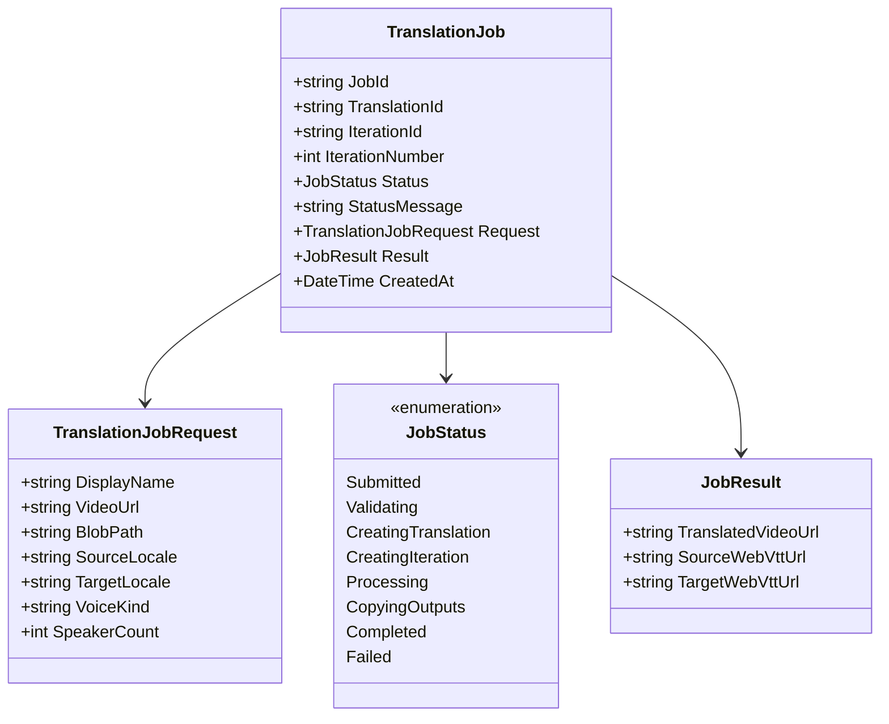

# Architecture

## Table of Contents
- [Overview](#overview)
- [High-Level Architecture](#high-level-architecture)
- [Components](#components)
- [API Reference](#api-reference)
- [Data Flow](#data-flow)
- [Azure Services](#azure-services)
- [Infrastructure as Code](#infrastructure-as-code)
- [Security Architecture](#security-architecture)
- [Scalability Considerations](#scalability-considerations)

---

## Overview

The Video Translation Service is a cloud-native application built on Azure that automatically translates video content using Azure Speech Services Video Translation API. The system uses Azure Durable Functions to orchestrate a multi-step workflow that:

1. Accepts video files via URL or Azure Blob Storage path
2. Creates a translation job via Azure Speech Video Translation API
3. Creates an iteration to process the translation
4. Polls for completion with configurable timeout
5. Copies translated outputs to your storage account
6. Provides a Blazor WebAssembly UI for job management

### Key Design Principles

| Principle | Implementation |
|-----------|---------------|
| **Serverless** | Azure Functions with Standard (S1) plan for reliable performance |
| **Event-Driven** | HTTP triggers and Durable Functions orchestration |
| **Secure** | Managed identities, RBAC, Key Vault for secrets |
| **Observable** | Application Insights, Log Analytics, alerts |
| **Scalable** | App Service Plan scaling, stateless workers |
| **Idempotent** | Durable Functions replay-safe activities |
| **User-Friendly** | Blazor WebAssembly UI hosted on Static Web App |

---

## High-Level Architecture



---

## Components

### 1. Blazor WebAssembly UI (`src/ui/`)

**Purpose**: User-friendly web interface for video translation management.

```mermaid
graph LR
    subgraph "Blazor WebAssembly App"
        Home[Home.razor<br/>Dashboard]
        Create[Create.razor<br/>New Job Form]
        Details[JobDetails.razor<br/>Status & Downloads]
    end
    
    subgraph "Services"
        API[TranslationApiService.cs]
    end
    
    subgraph "Models"
        Models[JobModels.cs]
    end
    
    Home --> API
    Create --> API
    Details --> API
    API --> Models
```

| Page | Route | Purpose |
|------|-------|---------|
| **Dashboard** | `/` | View all translation jobs with status badges |
| **Create Job** | `/create` | Form for video URL/blob, language selection, voice options |
| **Job Details** | `/jobs/{jobId}` | View progress, download outputs, auto-refresh status |

**Technology Stack**:
- .NET 9 Blazor WebAssembly
- Bootstrap 5 with Bootstrap Icons
- Hosted on Azure Static Web App (Free tier)

### 2. API Layer (`src/api/Functions/`)

**Purpose**: HTTP entry points for the video translation service.

**File**: `TranslationFunctions.cs`

| Endpoint | Method | Description |
|----------|--------|-------------|
| `/api/jobs` | POST | Start a new video translation job |
| `/api/jobs` | GET | List all translation jobs |
| `/api/jobs/{jobId}` | GET | Check job status and get output URLs |
| `/api/jobs/{jobId}/iterate` | POST | Start a new iteration with edited WebVTT |

**Technology**: Azure Functions HTTP triggers with Durable Client (.NET 8 Isolated)

### 3. Orchestrator (`src/api/Orchestration/`)

**Purpose**: Coordinates the multi-step translation workflow using Durable Functions.

**File**: `VideoTranslationOrchestrator.cs`

**Pattern**: Polling-based state machine with 60-minute timeout



**Configuration**:
| Setting | Value |
|---------|-------|
| Polling Interval | 30 seconds |
| Max Duration | 60 minutes |
| Retry Attempts | 3 |
| Retry Backoff | Exponential (5s base) |

### 4. Activity Functions (`src/api/Activities/`)

**Purpose**: Individual activity functions for specific tasks.



| Activity | File | Responsibility |
|----------|------|----------------|
| `ValidateInputActivity` | `ValidateInputActivity.cs` | Validate video URL/blob path, generate SAS URL if needed |
| `CreateTranslationActivity` | `CreateTranslationActivity.cs` | Create translation via `PUT /translations/{id}` |
| `CreateIterationActivity` | `CreateIterationActivity.cs` | Create iteration via `PUT /translations/{id}/iterations/{id}` |
| `GetIterationStatusActivity` | `GetIterationStatusActivity.cs` | Poll iteration status via `GET /translations/{id}/iterations/{id}` |
| `CopyOutputsActivity` | `CopyOutputsActivity.cs` | Copy translated video/subtitles from Speech API URLs to your storage |

### 5. Services (`src/api/Services/`)

**Purpose**: Shared services and API clients.

| Service | Interface | Implementation | Responsibility |
|---------|-----------|----------------|----------------|
| Speech Translation | `ISpeechTranslationService` | `SpeechTranslationService.cs` | HTTP client for Speech Video Translation REST API |
| Blob Storage | `IBlobStorageService` | `BlobStorageService.cs` | Blob upload/download, SAS token generation, copy operations |

### 6. Models (`src/api/Models/`)

**Purpose**: Data transfer objects and domain models.



| Model | Location | Purpose |
|-------|----------|---------|
| `TranslationJobRequest` | `Models/TranslationJobRequest.cs` | API input from client |
| `TranslationJob` | `Models/TranslationJob.cs` | Orchestrator state object |
| `JobStatusResponse` | `Models/JobStatusResponse.cs` | API response DTO |
| `IterateRequest` | `Models/IterateRequest.cs` | Request for new iteration |
| Speech API Models | `Models/SpeechApi/*.cs` | Request/response types for Speech API |

---

## API Reference

### Base URL

- **Local Development**: `http://localhost:7071`
- **Production**: `https://funcapp-ama-{N}.azurewebsites.net`

### Endpoints

#### Create Translation Job

```http
POST /api/jobs
Content-Type: application/json

{
  "displayName": "My Video Translation",
  "videoUrl": "https://example.com/video.mp4",
  "sourceLocale": "en-US",
  "targetLocale": "es-ES",
  "voiceKind": "PersonalVoice",
  "speakerCount": 1
}
```

**Alternative with Blob Storage**:
```json
{
  "displayName": "My Video Translation",
  "blobPath": "videos/my-video.mp4",
  "sourceLocale": "en-US",
  "targetLocale": "fr-FR",
  "voiceKind": "PlatformVoice"
}
```

**Response** (202 Accepted):
```json
{
  "jobId": "abc123def456",
  "status": "Submitted",
  "statusUrl": "https://funcapp-ama-3.azurewebsites.net/api/jobs/abc123def456"
}
```

#### Get Job Status

```http
GET /api/jobs/{jobId}
```

**Response** (200 OK):
```json
{
  "jobId": "abc123def456",
  "displayName": "My Video Translation",
  "status": "Completed",
  "statusMessage": "Translation completed successfully",
  "iterationNumber": 1,
  "sourceLocale": "en-US",
  "targetLocale": "es-ES",
  "createdAt": "2026-01-12T10:30:00Z",
  "lastUpdatedAt": "2026-01-12T10:45:00Z",
  "result": {
    "translatedVideoUrl": "https://storageama3.blob.core.windows.net/outputs/abc123def456/translated.mp4",
    "sourceWebVttUrl": "https://storageama3.blob.core.windows.net/subtitles/abc123def456/source.vtt",
    "targetWebVttUrl": "https://storageama3.blob.core.windows.net/subtitles/abc123def456/target.vtt"
  }
}
```

#### List All Jobs

```http
GET /api/jobs
```

**Response** (200 OK):
```json
{
  "jobs": [
    {
      "jobId": "abc123def456",
      "status": "Completed",
      "createdAt": "2026-01-12T10:30:00Z",
      "lastUpdatedAt": "2026-01-12T10:45:00Z"
    },
    {
      "jobId": "xyz789ghi012",
      "status": "Processing",
      "createdAt": "2026-01-12T11:00:00Z",
      "lastUpdatedAt": "2026-01-12T11:05:00Z"
    }
  ]
}
```

### Status Values

| Status | Description |
|--------|-------------|
| `Submitted` | Job received, waiting to start |
| `Validating` | Validating input video and parameters |
| `CreatingTranslation` | Creating translation in Speech API |
| `CreatingIteration` | Creating iteration for processing |
| `Processing` | Translation in progress (polling) |
| `CopyingOutputs` | Copying results to storage |
| `Completed` | Translation complete, outputs available |
| `Failed` | Translation failed (see error details) |

### Supported Languages

| Code | Language |
|------|----------|
| `en-US` | English (US) |
| `en-GB` | English (UK) |
| `es-ES` | Spanish (Spain) |
| `es-MX` | Spanish (Mexico) |
| `fr-FR` | French |
| `de-DE` | German |
| `it-IT` | Italian |
| `pt-BR` | Portuguese (Brazil) |
| `zh-CN` | Chinese (Simplified) |
| `zh-TW` | Chinese (Traditional) |
| `ja-JP` | Japanese |
| `ko-KR` | Korean |
| `ar-SA` | Arabic |
| `hi-IN` | Hindi |

---

## Data Flow

### Video Translation Flow


### Iteration Flow (Refinement)


### Data Storage Layout


```
Storage Account: storageama{N}
├── videos/                      # Input video files
│   └── {jobId}/
│       └── original.mp4
├── outputs/                     # Translated outputs  
│   └── {jobId}/
│       └── translated-video.mp4
└── subtitles/                   # Generated subtitles
    └── {jobId}/
        ├── source.vtt           # Original language WebVTT
        └── target.vtt           # Translated language WebVTT
```

---

## Azure Services

### Service Architecture

```mermaid
graph TB
    subgraph "Resource Group: AMAFY26-deployment-{N}"
        subgraph "Frontend"
            SWA[Static Web App<br/>SWA-AMA-{N}<br/>Free Tier]
        end
        
        subgraph "Backend"
            ASP[App Service Plan<br/>ASP-AMA-{N}<br/>Standard S1]
            FUNC[Function App<br/>FuncApp-AMA-{N}<br/>.NET 8 Isolated]
        end
        
        subgraph "Storage"
            STORAGE[Storage Account<br/>storageama{N}<br/>Standard LRS]
        end
        
        subgraph "AI Services"
            SPEECH[Speech Services<br/>Speech-AMA-{N}<br/>S0 Tier]
            AI[AI Services<br/>AIServices-AMA-{N}<br/>S0 Tier]
        end
        
        subgraph "Security"
            KV[Key Vault<br/>KeyVault-AMA-{N}<br/>RBAC Enabled]
        end
        
        subgraph "Monitoring"
            APPINS[Application Insights<br/>AppInsights-AMA-{N}]
            LOG[Log Analytics<br/>LogAnalytics-AMA-{N}]
        end
    end
    
    SWA -->|CORS| FUNC
    FUNC --> ASP
    FUNC -->|Managed Identity| STORAGE
    FUNC -->|Managed Identity| SPEECH
    FUNC -->|Managed Identity| KV
    FUNC -.->|Telemetry| APPINS
    APPINS --> LOG
    SPEECH --> AI
```

### Core Services

| Service | Resource Name | SKU | Purpose |
|---------|---------------|-----|---------|
| **Static Web App** | `SWA-AMA-{N}` | Free | Blazor WebAssembly UI hosting |
| **Azure Functions** | `FuncApp-AMA-{N}` | S1 | Durable Functions API backend |
| **App Service Plan** | `ASP-AMA-{N}` | Standard S1 | Hosting plan for Functions |
| **Storage Account** | `storageama{N}` | Standard LRS | Blob storage (videos, outputs, subtitles) |
| **Speech Services** | `Speech-AMA-{N}` | S0 | Video Translation API |
| **AI Services** | `AIServices-AMA-{N}` | S0 | Cognitive Services (translation, language) |

### Supporting Services

| Service | Resource Name | Purpose |
|---------|---------------|---------|
| **Key Vault** | `KeyVault-AMA-{N}` | Secrets and certificate management |
| **Application Insights** | `AppInsights-AMA-{N}` | APM and distributed tracing |
| **Log Analytics** | `LogAnalytics-AMA-{N}` | Centralized logging and queries |

---

## Infrastructure as Code

### Bicep Structure


```
infra/
├── main.bicep                    # Entry point (subscription scope)
├── main.parameters.json          # Parameter values (optional)
├── deploy.ps1                    # PowerShell deployment script
├── deploy.sh                     # Bash deployment script
└── modules/
    ├── log-analytics.bicep       # Log Analytics Workspace
    ├── app-insights.bicep        # Application Insights
    ├── storage-account.bicep     # Storage + containers (videos, outputs, subtitles)
    ├── keyvault.bicep            # Key Vault (RBAC enabled)
    ├── speech-services.bicep     # Speech Services with custom subdomain
    ├── ai-foundry.bicep          # AI Services (Cognitive Services)
    ├── static-web-app.bicep      # Static Web App for Blazor UI
    ├── function-app.bicep        # Function App + S1 App Service Plan
    └── role-assignments.bicep    # RBAC for managed identities + user
```

### Module Dependencies


### Deployment

See [runbook.md](runbook.md) for detailed deployment instructions.

Quick start:
```powershell
cd infra
.\deploy.ps1 -DeploymentNumber 3
```

---

## Security Architecture

### Authentication & Authorization


### RBAC Role Assignments

| Principal | Resource | Role |
|-----------|----------|------|
| Function App MI | Storage Account | Storage Blob Data Contributor |
| Function App MI | Storage Account | Storage Queue Data Contributor |
| Function App MI | Storage Account | Storage Table Data Contributor |
| Function App MI | Key Vault | Key Vault Secrets User |
| Function App MI | Speech Services | Cognitive Services User |
| Function App MI | AI Services | Cognitive Services User |
| Function App MI | AI Services | Cognitive Services Contributor |
| User Principal | Speech Services | Cognitive Services User |
| User Principal | AI Services | Cognitive Services User |

**User Principal ID**: `716e5244-7a36-4bef-9fe6-18f8b62f3cce`

### Key Security Features

- ✅ **No hardcoded secrets** - All access via managed identity
- ✅ **RBAC on Key Vault** - No access policies, pure RBAC
- ✅ **TLS 1.2 minimum** - All services enforce TLS 1.2+
- ✅ **HTTPS only** - Storage and Function App HTTPS-only
- ✅ **Soft delete enabled** - Key Vault with purge protection
- ✅ **Diagnostic logging** - All services log to Log Analytics

---

## Scalability Considerations

### Azure Functions Scaling

| Plan | Max Instances | Scaling Behavior |
|------|---------------|------------------|
| **Standard (S1)** ✓ | Plan-based | Always-on, manual/auto scale |
| Consumption (Y1) | 200 | Event-driven, scale to zero |
| Premium | 100 | Pre-warmed instances |

**Current Configuration**: Standard S1 (selected due to quota availability)

### Durable Functions Considerations

- **Task Hub Partitioning**: Default 4 partitions, increase for high throughput
- **Entity Concurrency**: Orchestrations are single-threaded per instance
- **History Size**: Implement `ContinueAsNew` for long-running orchestrations
- **Storage Throttling**: Use Premium storage for high-volume scenarios

### Speech Services Limits (S0 Tier)

| Feature | Limit |
|---------|-------|
| Concurrent requests | 100 |
| Audio length | 10 hours per request |
| Real-time factor | Varies by language |

### Recommendations for Production

1. **Use Premium Functions Plan** for predictable latency
2. **Enable auto-scaling** with minimum instance count
3. **Implement circuit breakers** for external service calls
4. **Use CDN** for output file distribution
5. **Consider regional redundancy** for high availability
